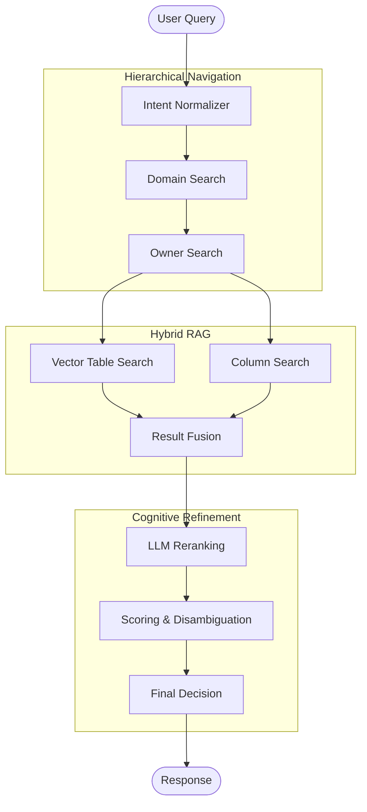

# 🔍 Data Search Agent

[](https://www.python.org/downloads/)
[](https://github.com/langchain-ai/langgraph)
[](https://opensource.org/licenses/MIT)

An intelligent **LangGraph-based agent** for semantic table search in enterprise Data Lakes. Designed to act as an autonomous Data Steward, navigating complex data catalogs to find the right information.

## ✨ Features

- **Hierarchical Search** – Navigate through Domain → Owner → Table levels
- **Hybrid RAG Pipeline** – Dense + Sparse retrieval with multi-vector search
- **LLM Reranking** – Smart result ordering using GPT models
- **Disambiguation Scoring** – Intelligent scoring to separate production tables from drafts/legacy
- **Column-Level Search** – Find tables by their column names and types
- **Feedback Learning** – Improves over time based on user interactions

## 🏗️ Architecture



## 📦 Installation

```bash
# Clone the repository
git clone https://github.com/o-lino/data-search-agent.git
cd data-search-agent

# Create virtual environment
python -m venv venv
source venv/bin/activate  # Linux/Mac
# or
.\venv\Scripts\activate  # Windows

# Install dependencies
pip install -r requirements.txt
```

## ⚙️ Configuration

Create a `.env` file in the root directory:

```env
OPENAI_API_KEY=your_openai_api_key
CHROMA_PERSIST_DIRECTORY=./data/chroma
```

## 🚀 Quick Start

```python
from graph import get_agent, create_initial_state

# Initialize the agent
agent = get_agent()

# Create initial state with your query
state = create_initial_state(query="Find customer transaction tables")

# Run the agent
result = agent.invoke(state)
print(result)
```

### Running the API Server

```bash
uvicorn admin_api:app --reload --port 8000
```

## 📁 Project Structure

```
data-search-agent/
├── agent/              # Agent core logic
├── disambiguation/     # Scoring and disambiguation algorithms
├── docs/               # Architecture and user guides
├── indexing/           # Data ingestion and vectorization
├── knowledge/          # Domain knowledge base
├── llm/                # LLM integration layer
├── memory/             # Conversation and feedback memory
├── metrics/            # Performance metrics
├── monitoring/         # Health checks and observability
├── nodes/              # LangGraph node implementations
├── quality/            # Data quality scoring
├── rag/                # RAG pipeline components
├── tests/              # Test suite
├── tools/              # Agent tools
├── graph.py            # Main graph orchestration
├── state.py            # Agent state definitions
└── admin_api.py        # FastAPI admin endpoints
```

## 📖 Documentation

- [Architecture Guide](docs/ARCHITECTURE.md) – System design and components
- [User Guide](docs/USER_GUIDE.md) – How to use the agent
- [Decision Logic](docs/DECISION_LOGIC.md) – Understanding the ranking algorithm
- [Performance Report](docs/PERFORMANCE_REPORT.md) – Benchmarks and metrics

## 🐳 Docker

```bash
# Build and run with Docker Compose
docker-compose up --build
```

## 🧪 Testing

```bash
# Run tests
python -m pytest tests/
```

## 📊 Disambiguation Scoring

The agent uses a weighted formula to rank results:

| Factor              | Weight | Description                                   |
| ------------------- | ------ | --------------------------------------------- |
| Semantic Similarity | 25%    | How well the table matches your query         |
| Technical Quality   | 50%    | Golden Source status, freshness, data quality |
| Historical Usage    | 15%    | Approved by other users for similar queries   |
| Owner Relevance     | 10%    | Is the owner appropriate for your domain?     |

## 🤝 Contributing

Contributions are welcome! Please feel free to submit a Pull Request.

## 📄 License

This project is licensed under the MIT License - see the [LICENSE](LICENSE) file for details.

---

**Built with ❤️ using LangGraph, ChromaDB, and OpenAI**
