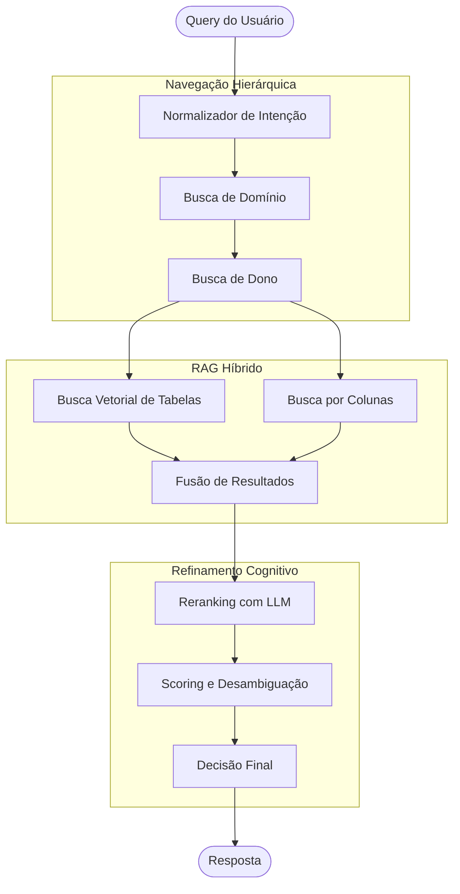

# 🔍 Agente de Busca de Dados

[](https://www.python.org/downloads/)
[](https://github.com/langchain-ai/langgraph)
[](https://opensource.org/licenses/MIT)
[](https://github.com/o-lino/data-search-agent/actions/workflows/ci.yml)
[](https://codecov.io/gh/o-lino/data-search-agent)
[](https://github.com/o-lino/data-search-agent/pkgs/container/data-search-agent)
[](CONTRIBUTING.md)

Um **agente inteligente baseado em LangGraph** para busca semântica de tabelas em Data Lakes corporativos. Projetado para atuar como um Data Steward autônomo, navegando por catálogos de dados complexos para encontrar a informação correta.

## ✨ Funcionalidades

- **Busca Hierárquica** – Navegação por níveis: Domínio → Dono → Tabela
- **Pipeline RAG Híbrido** – Recuperação densa + esparsa com busca multi-vetorial
- **Reranking com LLM** – Ordenação inteligente de resultados usando modelos GPT/Gemini
- **Desambiguação por Score** – Pontuação inteligente para separar tabelas oficiais de rascunhos/legado
- **Busca por Colunas** – Encontre tabelas pelos nomes e tipos de suas colunas
- **Aprendizado por Feedback** – Melhora ao longo do tempo baseado em interações dos usuários

## 🏗️ Arquitetura



## 📦 Instalação

```bash
# Clone o repositório
git clone https://github.com/o-lino/data-search-agent.git
cd data-search-agent

# Crie o ambiente virtual
python -m venv venv
source venv/bin/activate  # Linux/Mac
# ou
.\venv\Scripts\activate  # Windows

# Instale as dependências
pip install -r requirements.txt
```

## ⚙️ Configuração

Crie um arquivo `.env` no diretório raiz:

```env
OPENAI_API_KEY=sua_chave_openai
CHROMA_PERSIST_DIRECTORY=./data/chroma
```

## 🚀 Início Rápido

```python
from graph import get_agent, create_initial_state

# Inicialize o agente
agent = get_agent()

# Crie o estado inicial com sua consulta
state = create_initial_state(query="Encontrar tabelas de transações de clientes")

# Execute o agente
result = agent.invoke(state)
print(result)
```

### Executando o Servidor API

```bash
uvicorn admin_api:app --reload --port 8000
```

## 📁 Estrutura do Projeto

```
data-search-agent/
├── agent/              # Lógica central do agente
├── disambiguation/     # Algoritmos de scoring e desambiguação
├── docs/               # Guias de arquitetura e usuário
├── indexing/           # Ingestão de dados e vetorização
├── knowledge/          # Base de conhecimento de domínio
├── llm/                # Camada de integração com LLMs
├── memory/             # Memória de conversação e feedback
├── metrics/            # Métricas de performance
├── monitoring/         # Health checks e observabilidade
├── nodes/              # Implementações dos nós do LangGraph
├── quality/            # Scoring de qualidade de dados
├── rag/                # Componentes do pipeline RAG
├── tests/              # Suíte de testes
├── tools/              # Ferramentas do agente
├── graph.py            # Orquestração principal do grafo
├── state.py            # Definições de estado do agente
└── admin_api.py        # Endpoints FastAPI de administração
```

## 📖 Documentação

- [Guia de Arquitetura](docs/ARCHITECTURE.md) – Design do sistema e componentes
- [Guia do Usuário](docs/USER_GUIDE.md) – Como usar o agente
- [Lógica de Decisão](docs/DECISION_LOGIC.md) – Entendendo o algoritmo de ranking
- [Relatório de Performance](docs/PERFORMANCE_REPORT.md) – Benchmarks e métricas
- [Melhorias de Acurácia](docs/ACCURACY_IMPROVEMENTS.md) – Estratégias de otimização

## 🐳 Docker

```bash
# Build e execução com Docker Compose
docker-compose up --build
```

## 🧪 Testes

```bash
# Execute os testes
python -m pytest tests/
```

## 📊 Sistema de Desambiguação

O agente usa uma fórmula ponderada para rankear resultados:

| Fator                  | Peso | Descrição                                              |
| ---------------------- | ---- | ------------------------------------------------------ |
| Similaridade Semântica | 25%  | Quão bem a tabela corresponde à sua consulta           |
| Qualidade Técnica      | 50%  | Status Golden Source, atualização, qualidade dos dados |
| Histórico de Uso       | 15%  | Aprovada por outros usuários para consultas similares  |
| Relevância do Dono     | 10%  | O dono é apropriado para seu domínio?                  |

## 🤝 Contribuindo

Contribuições são bem-vindas! Sinta-se à vontade para enviar um Pull Request.

## 📄 Licença

Este projeto está licenciado sob a Licença MIT - veja o arquivo [LICENSE](LICENSE) para detalhes.

---

**Construído com ❤️ usando LangGraph, ChromaDB e OpenAI**
