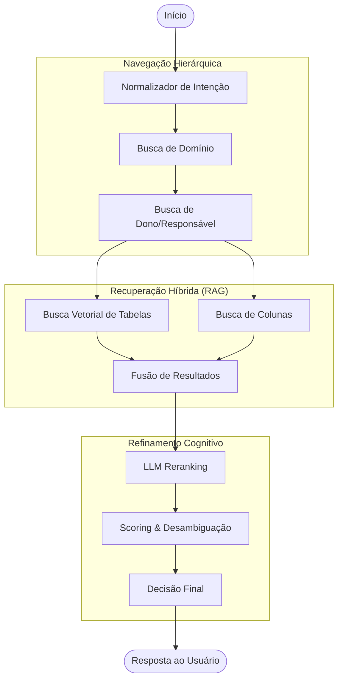
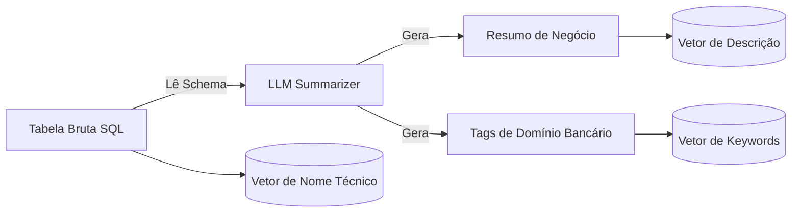

# Arquitetura do Sistema Leandrinho

Este documento descreve a arquitetura técnica do Agente de Busca de Dados "Leandrinho". O sistema foi projetado para atuar como um _Data Steward_ autônomo, capaz de navegar pela complexidade de um Data Lake corporativo para encontrar a informação correta.

## Visão Geral

O sistema não é um simples buscador de palavras-chave. Ele é um **Agente Cognitivo** construído sobre o framework **LangGraph**. Isso significa que ele possui "memória", mantém estado durante a conversa e executa um fluxo de raciocínio em etapas (Grafo de Nós).

### Diagrama de Alto Nível (O Fluxo de Raciocínio)

---

## Componentes Principais

### 1. Cérebro: LangGraph (`graph.py`)

O sistema é orquestrado por um grafo de estados. Cada "caixa" no diagrama acima é um nó Python independente que recebe o estado atual (`AgentState`, definido em `state.py`), processa uma tarefa específica e passa o resultado adiante.

**Vantagem**: Modularidade. Podemos melhorar a lógica de "Busca de Dono" sem quebrar a "Busca de Tabelas".

### 2. O Pipeline de RAG Avançado (Retrieval-Augmented Generation)

Diferente de sistemas RAG comuns que indexam texto bruto, o Leandrinho implementa um pipeline de **"Deep Enrichment"**.

#### Fase de Ingestão (Antes da Busca)

Quando um dado entra no sistema, ele passa por uma transformação:

**Por que isso existe?**
Tabelas corporativas têm nomes ruins (`TB_VND_CLI_01`). O LLM escreve uma descrição humana ("Tabela consolidada de vendas por cliente do varejo") que torna o dado encontrável.

#### Fase de Busca (Durante a Query)

A estratégia de busca é **Multi-Vector + Híbrida**:

1.  **Dense Retrieval**: Busca nos 3 vetores simultaneamente (Nome, Descrição, Tags).
2.  **Sparse Retrieval (BM25)**: Busca por palavras exatas (garante que se você digitar o ID da tabela, ela apareça).
3.  **LLM Reranking**: Os Top-10 resultados matemáticos são enviados para um LLM que atua como juiz final, reordenando a lista com base na pergunta do usuário.

---

### 3. Sistema de Desambiguação (`disambiguation/`)

Em grandes empresas, existem muitas tabelas parecidas (versões antigas, rascunhos, dados oficiais). O sistema usa um algoritmo de pontuação para separar o "joio do trigo".

A fórmula de ranking **não é** apenas similaridade de texto. Ela considera:

- **25% Similaridade Semântica**: O quanto a tabela parece com o que você pediu.
- **50% Qualidade Técnica**:
  - É _Golden Source_? (Oficial)
  - Está atualizada? (Freshness)
  - Tem boa qualidade de dados? (Data Quality Score)
- **15% Histórico**: Essa tabela já foi aprovada por outros usuários para perguntas parecidas?
- **10% Dono**: O dono da tabela é a pessoa certa para o seu domínio?

---

### 4. Monitoramento e Ops (`monitoring/`)

O sistema foi desenhado para produção, contendo:

- **Health Checkers**: Endpoints que monitoram se o OpenAI e o ChromaDB estão respondendo.
- **Data Mesh Exporter**: O sistema envia métricas de uso para o Data Lake da empresa, permitindo auditoria de quais dados são mais buscados.
