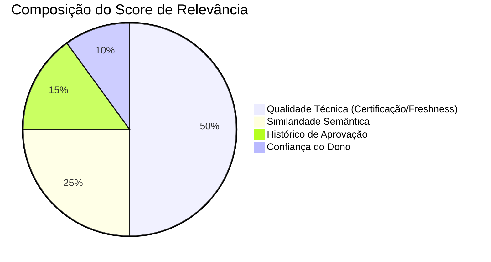

# Lógica de Decisão e Desambiguação

Este documento detalha como o Leandrinho decide qual tabela recomendar quando existem múltiplas opções ou nenhuma opção clara.

## O Desafio da Ambiguidade

Em um Data Lake, é comum encontrar:

1.  **Homonímia**: Tabelas com mesmo nome em áreas diferentes (`TB_CLIENTE` no Marketing vs `TB_CLIENTE` no Cadastro).
2.  **Fragmentação**: Tabelas quebradas por ano (`_2022`, `_2023`).
3.  **Qualidade Variável**: Tabelas oficiais (Golden) misturadas com tabelas de teste (Sandbox).

Para resolver isso, usamos um **Score Multidimensional**.

---

## 1. O Algoritmo de Ranking (`disambiguation/scorer.py`)

A nota final de uma tabela (0.0 a 1.0) é composta pela soma ponderada de 4 pilares:

### Detalhe dos Pesos

| Componente            | Peso    | Descrição                                                                                                                                                                                       |
| :-------------------- | :------ | :---------------------------------------------------------------------------------------------------------------------------------------------------------------------------------------------- |
| **Qualidade Técnica** | **50%** | Verifica se o dado é confiável. Tabelas `Golden Source` e `Visão Cliente` ganham nota máxima (1.0). Tabelas `Sandbox` ou desatualizadas (D-1 que não roda há 2 dias) perdem pontos severamente. |
| **Semântica**         | **25%** | O quanto o conteúdo da tabela bate com a pergunta do usuário. Calculado via Vetores (Embeddings).                                                                                               |
| **Histórico**         | **15%** | "Sabedoria das Multidões". Se 50 analistas usaram a tabela X para essa pergunta no passado, ela ganha prioridade sobre uma tabela nova Y.                                                       |
| **Dono**              | **10%** | Se a tabela pertence a um _Owner_ que já foi validado como autoridade no Domínio da busca.                                                                                                      |

**Nota Importante**: O peso de **Qualidade Técnica (50%)** é propositalmente maior que o Semântico (25%). O sistema prefere entregar uma tabela _oficial_ com match semântico "médio" do que uma tabela "lixo" com match perfeito.

---

## 2. O Detector de Ambiguidade (`disambiguation/ambiguity_detector.py`)

Após rankear, o sistema não entrega o Top-1 cegamente. Ele roda um detector de ambiguidade que pode pausar a resposta e fazer uma pergunta ao usuário.

### Regras de Interrupção

O detector dispara nas seguintes situações:

#### A. Empate Técnico (Score Tie)

Se a diferença entre o 1º e o 2º lugar for menor que **5%** (`0.05`), o sistema pergunta:

> "Encontrei duas opções muito similares: Tabela A e Tabela B. Qual prefere?"

#### B. Conflito de Domínio

Se o 1º lugar é de **Vendas** e o 2º é de **Risco**, ele entende que a palavra-chave pode ter duplo sentido.

> "Você está buscando isso sob a ótica Comercial ou de Risco?"

#### C. Fragmentação Temporal

Se o sistema detecta sufixos de data (`_2024`, `_jan_24`).

> "Esses dados estão quebrados por período. Qual mês/ano você precisa?"

---

## 3. Matriz de Decisão do Agente (`decision_builder_v2.py`)

A decisão final do agente segue esta matriz lógica:

| Data Existence     | Tabela Confidence | Ação do Agente       | Mensagem ao Usuário                                                       |
| :----------------- | :---------------- | :------------------- | :------------------------------------------------------------------------ |
| **EXISTS**         | Alta (> 70%)      | `USE_TABLE`          | "Aqui está a tabela correta: [Link]"                                      |
| **EXISTS**         | Média (40-69%)    | `CONFIRM_WITH_OWNER` | "A melhor opção parece ser esta, mas confirme com [Owner] antes de usar." |
| **UNCERTAIN**      | Baixa (< 40%)     | `UNCERTAINTY`        | "Não encontrei nada exato. Aqui estão algumas opções de [Domínio]..."     |
| **NEEDS_CREATION** | Nula              | `CREATE_INVOLVEMENT` | "Esse dado não existe. Deseja abrir um chamado para criar?"               |

Essa matriz garante que o agente nunca "alucine" um dado que não existe.
